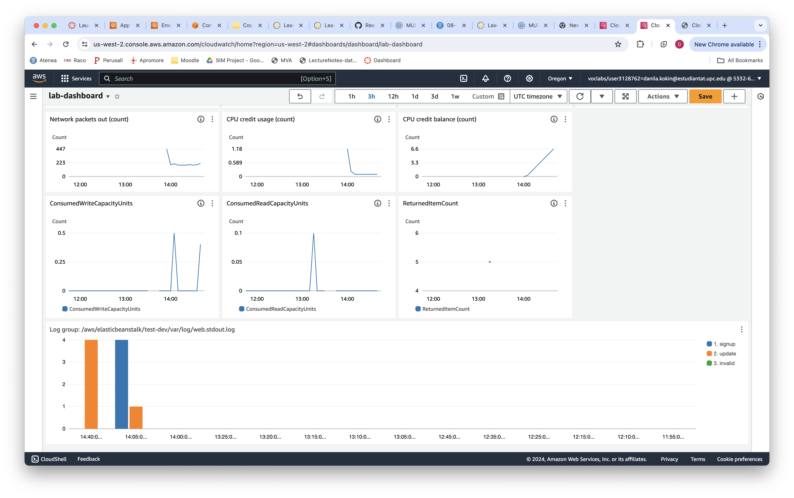
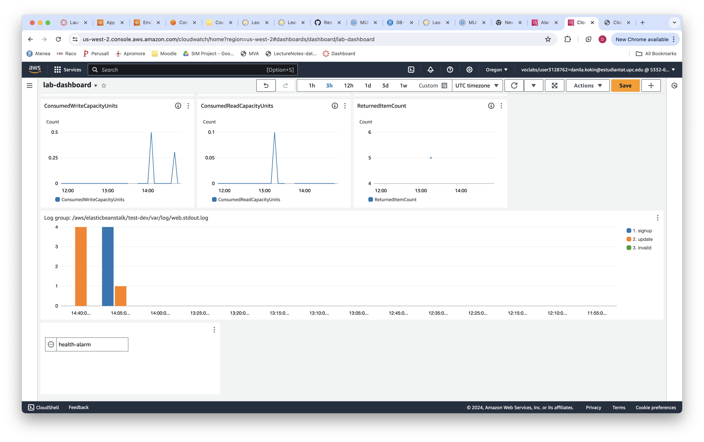

# Validation of the tutorial done by Team-4

## Intro - Cloud Visualization Approaches

Cloud visualization is a critical component in cloud computing, enabling administrators and developers to monitor and manage cloud resources effectively. Visualizing these resources allows for a clearer understanding of system behaviors, resource usage, and operational trends. 

## Reproduction of the tutorial

### Task 1: Deploy a web App

We start with the web app deployment. It is very convenient that team made a `create.table.sh` bash script to automate creation of the **DynamoDB** table. By moving to `test` directory we configure Elastic Beanstalk environment and execute `ebcreate.py` script which gives us a command to be inserted in the terminal. 

> [!NOTE]
> I found the following suggested command auxiliary:
> `eb logs --cloudwatch-logs enable`
> since my app already enabled logs when did the setup. However, maybe it has happened in my reproduction.

So, we got the log groups as it is shown in the tutorial:


After we opened the web app and tried to register several users using the provided instructions. Authors has asked us to try these corner cases:
- Register some valid emails.
- Try to register the same email twice.
- Try to register some invalid emails (for simplicity the condition for an invalid email is that it does not contain an @ symbol).


### Task 2: Visualization

#### 2.1 & 2.2: Visualize the state of the application & EC2 instance metrics


As you can see we easily recreated required graphs. This process was pretty straight forward, so nothing could go wrong.

#### 2.3: Visualize DynamoDB metrics

> Q1: Try to create a line plot widget to show a metric more directly related to the number of users managed by the database. Tip: use some metric from Table Operation Metrics.

Here we provided some statistics of our dynamoDB table responsible for storing registered users. We recreated 2 graphs: the `ConsumedReadCapacityUnits` and the `ConsumedWriteCapacityUnits`. 

Additionally, we did the graph from the 1st question — for that we went to `DynamoDB > Table Operation Metrics > ReturnedItemCount`, which is responsible for scanning and returning number of rows in the specified table.


As you can see our table contains 5 users.

#### 2.4: Logs visualization

> Q2: Try to expand this bar plot to also include bars showing the count for two other messages that the application is creating: "Existing item updated to database." and "Email address is invalid." you only need to slightly modify the previous query.

We managed to recreate the plot from the tutorial.



That is how solution for question 2 looks like:

```kotlin
fields @timestamp, @message 
| parse @message "New item added to database." as newItem
| parse @message "*Existing item updated to database.*" as updatedItem
| parse @message "*Email address is invalid.*" as invalidEmail
| stats count(newItem) as signup, count(updatedItem) as update, count(invalidEmail) as invalid by bin(5m)
```

We learned how to create complex graphs with multiple groups from the log group by using queries. I liked the possible extension of this topic and reference to an AI assisted **Query generator**.   

#### 2.5: Setting an alarm

Finally, we created the full dashboard with the `health-alarm` widget. This alarm will indicate of Beanstalk application




> Q3: Try to stop the EC2 instance and wait some minutes. How do you observe this problematic situation in the dashboard?

Nothing will happen because of the autoscaling enabled. New instance will be initiated right after we stopped the current one.

## Summary

This research project is well written and structured. I truly enjoyed doing this tutorial and solutions for the questions provided especially. I faced a lot of explanation of the code and wide choice of the tools for visualisations. Overall, the topic was fully covered. 