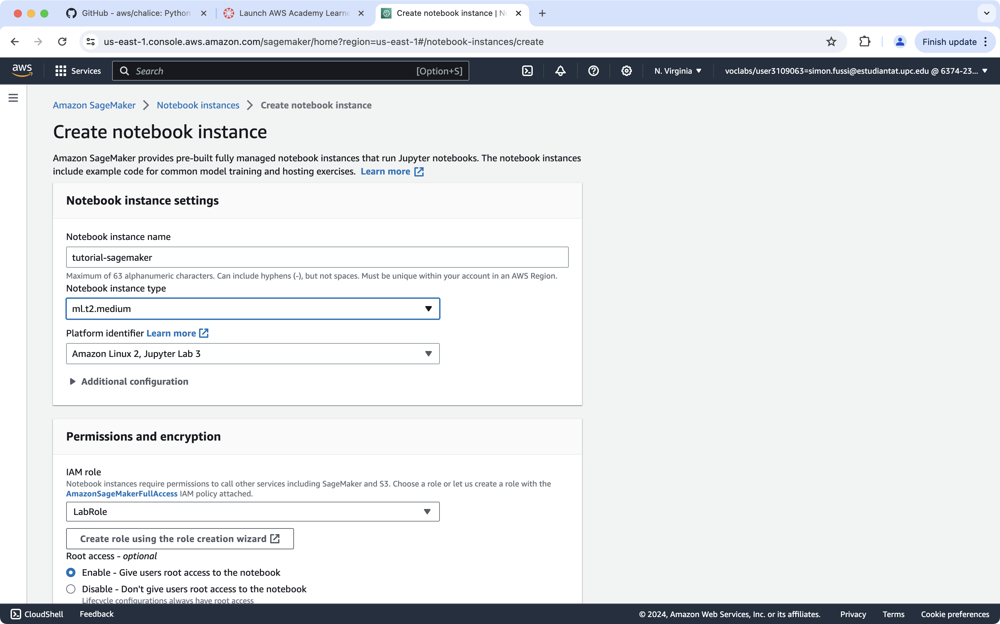
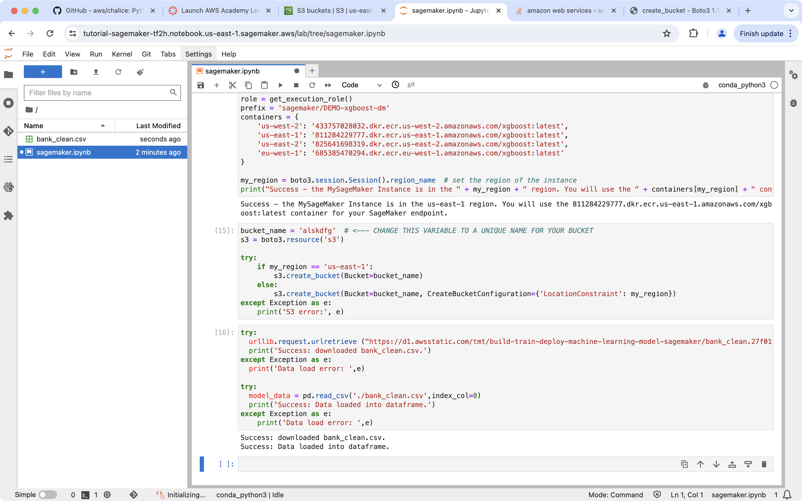
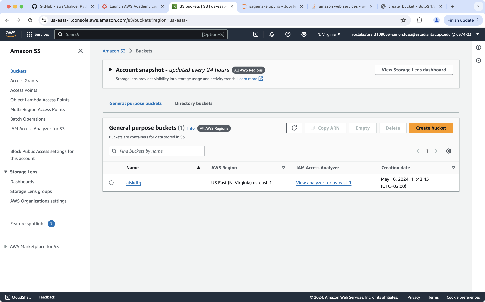
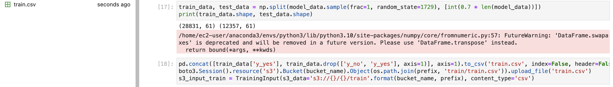
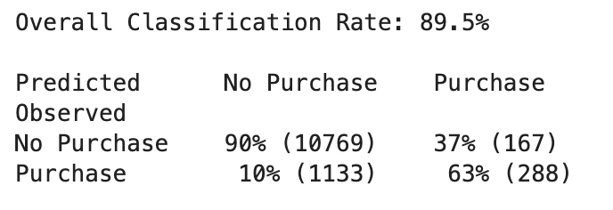

# Validation of the tutorial done by Team-5

## Intro - AWS SageMaker

The introduction of this tutorial was very elaborate, well written and they even included links to further explore what the AWS SageMaker is about. I just want to highlight that many of the tutorials we did throughout our lab sessions were not as well explained beforehand and here they did a good job of getting us curious for what we are about to learn. They also highlighted security concerns in real life which are ignored for the tutorial to make sure we do not forget that this is just about getting to know the technology.

## Reproduction of the tutorial

Setting up a new notebook

We proceeded the tutorial as expected and pasted and executed the code. Everything worked properly and as can be seen in the following two screenshots the .csv file was created and also the bucket exists now in my s3 section of the console.

Afterwards we executed the next 2 code snippets and the train.csv was created as expected.

Next step was the training part and deployment part. I was very nice of them to mention that we need to wait for the ! at the end.

We got the expected result (12357,)

In the end we evaluated the results and had success.

## Summary

This research project was very good. I did not encounter any errors and the results I should get and my own every time matched. The only minor detail which may be even out of scope or was not even asked would be a more elaborate explanation of the code we pasted. Since we used lots of code in this assingment and to understand what happens we had to google it ourselfs for more details.
