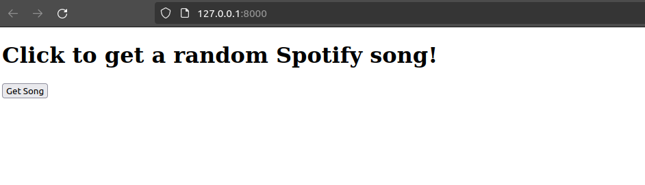

# Research topic: Spotify Integrated App
The idea is to have a website with which you get a random song name with its artist and spotify code. The spotify codes look like this:


You can try to scan the code with your spotify app (Go to the search bar and click on the camera symbol). We will be using the Spotify API for getting the random song and for the deployment we will use AWS Elastic Beanstalk. 

## Prerequesites
1. You need to have a spotify account (either free or premium). If you don't have an account, you have to register here https://www.spotify.com/es/signup

2. You need to have ```AWS CLI``` and ```AWS EB CLI``` installed and configured. This should be the case if you finished lab 5. If not then complete [Getting Started in the Cloud (with AWS)](https://github.com/CCBDA-UPC/Cloud-Computing-QuickStart/blob/master/Quick-Start-AWS.md) before beginning work on this assignment.

## Getting a random song of the Spotify API
### Create an App
1. Go to https://developer.spotify.com/ and log yourself in with your spotify account.

2. Go to your dashboard (Click on your name and then Dashboard) and create a new app. With the following properties:
    - ```App name = ccbda_research```
    - ```App description = Research topic for CCBDA```
    - ```Redirect URIs = http://localhost:3000``` (you don't need that but it is mandatory to specify)

3. Leave the rest blank and click the Developer Terms of Service checkbox and tap on the Create button

### Get the access token
1. After creating your app go to the settings of the app. Save your Client ID and your Client secret (available when you click on ```View client secret```) 

2. Go ahead and clone the following repository https://github.com/Johnhi19/research.git


3. in the ```spotify_script.py``` file, replace ```YOUR-CLIENT-ID``` and ```YOUR-CLIENT-SECRET``` with the Client ID and the Client secret of your app. The ```get_token()``` function creates an access token valid for one hour. You need to have a valid access token when calling the Spotify API. The token should look something like this: 
```
BQDBKJ5eo5jxbtpWjVOj7ryS84khybFpP_lTqzV7uV-T_m0cTfwvdn5BnBSKPxKgEb11
```

4. To get a random song look at the ```request_valid_song``` function. This function calls the Spotify API and searches for a random song. When it doesn't find a valid song, it rick rolls you. When executing this code, you should get a random song with its artist and spotify code.

## Creating a web page using flask
The ```application.py``` file is a simple flask script that deploys the python code to a web page. To execute the code locally, you first need to create a venv and run the following command inside:
```
(venv) _$ pip install -r requirements.txt
```
This downloads all the dependencies needed.

To test the app locally use the following command:
```
(venv) _$ python3 application.py
```
You can open the web app locally on the following IP address http://127.0.0.1:8000. It should look like this:



You can play around a bit by clicking on the get song button.

## Deploy your application with AWS Beanstalk
1. Start your learners lab and save the credentials in ```~/.aws/credentials```
2. Run the command ```_$ eb init --profile default```
```
Select a default region
1) us-east-1 : US East (N. Virginia)
...
(default is 3): 1

Select an application to use
...
2) [ Create new Application ]
(default is 2): 1

It appears you are using Python. Is this correct?
(Y/n): y
Select a platform branch.
1) Python 3.11 running on 64bit Amazon Linux 2023
...
(default is 1): 

Cannot setup CodeCommit because there is no Source Control setup, continuing with initialization
Do you want to set up SSH for your instances?
(Y/n): n
```
3. Now that you configured your local repository for your Elastic Beanstalk environment, you can run the following command to create the eb environment (replace ```<yours>``` with your credentials):
```
_$ eb create -ip LabInstanceProfile --service-role LabRole  --elb-type application --envvars "AWS_REGION=us-east-1,DEBUG=True,AWS_ACCESS_KEY_ID=<yours>,AWS_SECRET_ACCESS_KEY=<yours>,AWS_SESSION_TOKEN=<yours>"
```
The following output will be created. The creation of the eb environment might take a while, wait until it is finished: 
```
Enter Environment Name
(default is spotify-dev): 
Enter DNS CNAME prefix
(default is spotify-dev): 

Would you like to enable Spot Fleet requests for this environment? (y/N): n
Creating application version archive "app-240508_163138882983".
Uploading: [##################################################] 100% Done...
Environment details for: spotify-dev
  Application name: spotify
  Region: us-east-1
  Deployed Version: app-240508_163138882983
  Environment ID: e-jpyuxpugmn
  Platform: arn:aws:elasticbeanstalk:us-east-1::platform/Python 3.11 running on 64bit Amazon Linux 2023/4.0.11
  Tier: WebServer-Standard-1.0
  CNAME: spotify-dev.us-east-1.elasticbeanstalk.com
  Updated: 2024-05-08 14:31:46.752000+00:00
Printing Status:
2024-05-08 14:31:45    INFO    createEnvironment is starting.
2024-05-08 14:31:46    INFO    Using elasticbeanstalk-us-east-1-992382486883 as Amazon S3 storage bucket for environment data.
2024-05-08 14:32:09    INFO    Created security group named: sg-013e016f992904405
2024-05-08 14:32:09    INFO    Created security group named: awseb-e-jpyuxpugmn-stack-AWSEBSecurityGroup-crIzLXOKyD8t
2024-05-08 14:32:09    INFO    Created Auto Scaling launch configuration named: awseb-e-jpyuxpugmn-stack-AWSEBAutoScalingLaunchConfiguration-5VYGllEzXItQ
2024-05-08 14:32:25    INFO    Created target group named: arn:aws:elasticloadbalancing:us-east-1:992382486883:targetgroup/awseb-AWSEB-VJZH3NI92GNV/a9df4466e70bb863
2024-05-08 14:32:40    INFO    Created Auto Scaling group named: awseb-e-jpyuxpugmn-stack-AWSEBAutoScalingGroup-YkWwro7AegoD
2024-05-08 14:32:40    INFO    Waiting for EC2 instances to launch. This may take a few minutes.
2024-05-08 14:32:41    INFO    Created CloudWatch alarm named: awseb-e-jpyuxpugmn-stack-AWSEBCloudwatchAlarmHigh-5dyryqlLhyrp
2024-05-08 14:32:41    INFO    Created CloudWatch alarm named: awseb-e-jpyuxpugmn-stack-AWSEBCloudwatchAlarmLow-3x9wkwoKRuRT
2024-05-08 14:32:41    INFO    Created Auto Scaling group policy named: arn:aws:autoscaling:us-east-1:992382486883:scalingPolicy:0be64a3f-3da1-4ff3-ab80-623a09941dd4:autoScalingGroupName/awseb-e-jpyuxpugmn-stack-AWSEBAutoScalingGroup-YkWwro7AegoD:policyName/awseb-e-jpyuxpugmn-stack-AWSEBAutoScalingScaleUpPolicy-Z1fvmmLKtInj
2024-05-08 14:32:41    INFO    Created Auto Scaling group policy named: arn:aws:autoscaling:us-east-1:992382486883:scalingPolicy:16f28984-aefb-4eed-9f05-3255aeb44d9e:autoScalingGroupName/awseb-e-jpyuxpugmn-stack-AWSEBAutoScalingGroup-YkWwro7AegoD:policyName/awseb-e-jpyuxpugmn-stack-AWSEBAutoScalingScaleDownPolicy-RrGmeKhSHY0E
2024-05-08 14:34:46    INFO    Created load balancer named: arn:aws:elasticloadbalancing:us-east-1:992382486883:loadbalancer/app/awseb--AWSEB-DbDuVuR5XV1n/5165753cd6fab0a7
2024-05-08 14:34:46    INFO    Created Load Balancer listener named: arn:aws:elasticloadbalancing:us-east-1:992382486883:listener/app/awseb--AWSEB-DbDuVuR5XV1n/5165753cd6fab0a7/0fb41405599f28e6
2024-05-08 14:34:56    INFO    Instance deployment successfully generated a 'Procfile'.
2024-05-08 14:35:01    INFO    Instance deployment completed successfully.
2024-05-08 14:35:17    INFO    Application available at spotify-dev.us-east-1.elasticbeanstalk.com.
2024-05-08 14:35:18    INFO    Successfully launched environment: spotify-dev
```
4. After the eb environment successfully launched, you can use the ```eb open``` command to verify that everything worked. The website should look like this:


